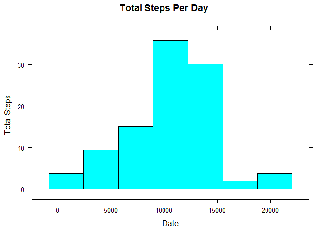

# Reproducible Research: Peer Assessment 1


## Loading and preprocessing the data

```r
#Create file if file isn't downloaded to working director yet, this includes unzipping file 
  if(!file.exists("./activity")){dir.create("./activity")}
  
  if(!file.exists("activity.zip"))
  {
    download.file("https://d396qusza40orc.cloudfront.net/repdata%2Fdata%2Factivity.zip",destfile ="./activity.zip",method="auto")
    unzip("./activity.zip", "./")
  }else
  {
    unzip(zipfile = "./activity.zip",exdir = "./activity")
  }
  readPath <- file.path("./" , "activity")
  files<-list.files(readPath, recursive=TRUE)
  files
```

```
## [1] "activity.csv"
```

```r
  activityData <- read.csv(file = "./activity/activity.csv", sep = ",", header = TRUE)
```


## What is mean total number of steps taken per day?
### Total, Mean and Median Steps Taken per Day

```r
#Calculates the total, mean and median number of steps per day using aggreate function.
totalDailyActivityData <- aggregate(steps~date, data = activityData, sum, na.rm=TRUE)
totalDailyActivityData$meanSteps <- aggregate(steps~date, data = activityData, mean, na.rm=TRUE)[,"steps"]
totalDailyActivityData$medianSteps <- aggregate(steps~date, data = activityData, median, na.rm=TRUE)[,"steps"]

#Round mean and median steps since steps will always be a whole number and can't be a fraction.
totalDailyActivityData$meanSteps <- sapply(totalDailyActivityData$meanSteps, round, digits = 0)
totalDailyActivityData$meadianSteps <- sapply(totalDailyActivityData$medianSteps, round, digits = 0)

#Specify column names for better use later
names(totalDailyActivityData) = c("date","totalSteps","meanSteps","medianSteps")

totalDailyActivityData <- totalDailyActivityData[,c("date","totalSteps","meanSteps","medianSteps")]

#Table showing the total, mean and median number of steps for each day.
totalDailyActivityData
```

```
##          date totalSteps meanSteps medianSteps
## 1  2012-10-02        126         0           0
## 2  2012-10-03      11352        39           0
## 3  2012-10-04      12116        42           0
## 4  2012-10-05      13294        46           0
## 5  2012-10-06      15420        54           0
## 6  2012-10-07      11015        38           0
## 7  2012-10-09      12811        44           0
## 8  2012-10-10       9900        34           0
## 9  2012-10-11      10304        36           0
## 10 2012-10-12      17382        60           0
## 11 2012-10-13      12426        43           0
## 12 2012-10-14      15098        52           0
## 13 2012-10-15      10139        35           0
## 14 2012-10-16      15084        52           0
## 15 2012-10-17      13452        47           0
## 16 2012-10-18      10056        35           0
## 17 2012-10-19      11829        41           0
## 18 2012-10-20      10395        36           0
## 19 2012-10-21       8821        31           0
## 20 2012-10-22      13460        47           0
## 21 2012-10-23       8918        31           0
## 22 2012-10-24       8355        29           0
## 23 2012-10-25       2492         9           0
## 24 2012-10-26       6778        24           0
## 25 2012-10-27      10119        35           0
## 26 2012-10-28      11458        40           0
## 27 2012-10-29       5018        17           0
## 28 2012-10-30       9819        34           0
## 29 2012-10-31      15414        54           0
## 30 2012-11-02      10600        37           0
## 31 2012-11-03      10571        37           0
## 32 2012-11-05      10439        36           0
## 33 2012-11-06       8334        29           0
## 34 2012-11-07      12883        45           0
## 35 2012-11-08       3219        11           0
## 36 2012-11-11      12608        44           0
## 37 2012-11-12      10765        37           0
## 38 2012-11-13       7336        25           0
## 39 2012-11-15         41         0           0
## 40 2012-11-16       5441        19           0
## 41 2012-11-17      14339        50           0
## 42 2012-11-18      15110        52           0
## 43 2012-11-19       8841        31           0
## 44 2012-11-20       4472        16           0
## 45 2012-11-21      12787        44           0
## 46 2012-11-22      20427        71           0
## 47 2012-11-23      21194        74           0
## 48 2012-11-24      14478        50           0
## 49 2012-11-25      11834        41           0
## 50 2012-11-26      11162        39           0
## 51 2012-11-27      13646        47           0
## 52 2012-11-28      10183        35           0
## 53 2012-11-29       7047        24           0
```

### 2. Histogram of Total Steps per Day

```r
#Lattice bar chart to create a histogram of totals per day
require(lattice)
```

```
## Loading required package: lattice
```

```r
barchart(totalSteps~date , data = totalDailyActivityData, horiz = FALSE, xlab  = "Date", ylab = "Total Steps", main="Total Steps Per Day",
            panel = function(x,y,...){
                panel.barchart(x, y, ...)
                panel.text(x, y, label = totalDailyActivityData$totalSteps, pos = 3,cex = 0.6, srt = 90)
            }, scales=list(x=list(rot=90)))
```

<!-- -->


## What is the average daily activity pattern?
### Activity pattern per interval and interval containing maximum average steps

```r
require(lattice)
#Calculate the mean steps per 5-minute interval
meanIntervalActivityData <- aggregate(steps~interval, data = activityData, mean, na.rm=TRUE)
meanIntervalActivityData$steps <- sapply(meanIntervalActivityData$steps, round,digits = 0)

#Plot time series of mean steps per interval includes showing interval with max mean steps
xyplot(steps~interval, data = meanIntervalActivityData, type = 'l', xlab  = "Interval", ylab = "Average Steps", main="Average Steps Taken Per Interval",panel = function(x,y,...){
                panel.xyplot(x, y, ...)
                panel.abline(v=x[ which(y==max(meanIntervalActivityData$steps))], lty = 1, col = "black")
                panel.text(meanIntervalActivityData[meanIntervalActivityData$steps == max(meanIntervalActivityData$steps),"interval"],max(meanIntervalActivityData$steps),labels = paste("Mean MaxStep Interval = ",  meanIntervalActivityData[meanIntervalActivityData$steps == max(meanIntervalActivityData$steps),"interval"]))
            }, scales = list(x=list(rot=90)))
```

<!-- -->


## Imputing missing values
### Total missing values

```r
length(activityData[is.na(activityData$steps), "steps"])
```

```
## [1] 2304
```

### Impute data with averages per interval. Mean and Median Steps per Day for imputed data

```r
#Merge daily activityData with meanIntervalActivityData to get the means of all the intervals
imputedActivityData <- merge(activityData, meanIntervalActivityData, by = "interval", all.x = TRUE)
names(imputedActivityData) = c("interval", "steps", "date", "meanSteps")

#Replace missing data for each steps with the mean of that specific interval.
imputedActivityData$steps[is.na(imputedActivityData$steps)] <- imputedActivityData$meanSteps[is.na(imputedActivityData$steps)]
imputedActivityData <- imputedActivityData[order(imputedActivityData$date),c("steps","date","interval")]

#Calculates the total, mean and median number of steps per day using aggreate function.
totalImputedDailyActivityData <- aggregate(steps~date, data = imputedActivityData, sum)
totalImputedDailyActivityData$meanSteps <- aggregate(steps~date, data = imputedActivityData, mean)[,"steps"]
totalImputedDailyActivityData$medianSteps <- aggregate(steps~date, data = imputedActivityData, median)[,"steps"]

#Round mean steps since steps will always be a whole number and can't be a fraction.
totalImputedDailyActivityData$meanSteps <- sapply(totalImputedDailyActivityData$meanSteps, round, digits = 0)
totalImputedDailyActivityData$medianSteps <- sapply(totalImputedDailyActivityData$medianSteps, round, digits = 0)

#Specify column names for better use later
names(totalImputedDailyActivityData) = c("date","totalSteps","meanSteps","medianSteps")
totalImputedDailyActivityData <- totalImputedDailyActivityData[,c("date","totalSteps","meanSteps","medianSteps")]

#Table showing the mean and median number of steps for each day.
totalImputedDailyActivityData[,c("date","meanSteps","medianSteps")]
```

```
##          date meanSteps medianSteps
## 1  2012-10-01        37          34
## 2  2012-10-02         0           0
## 3  2012-10-03        39           0
## 4  2012-10-04        42           0
## 5  2012-10-05        46           0
## 6  2012-10-06        54           0
## 7  2012-10-07        38           0
## 8  2012-10-08        37          34
## 9  2012-10-09        44           0
## 10 2012-10-10        34           0
## 11 2012-10-11        36           0
## 12 2012-10-12        60           0
## 13 2012-10-13        43           0
## 14 2012-10-14        52           0
## 15 2012-10-15        35           0
## 16 2012-10-16        52           0
## 17 2012-10-17        47           0
## 18 2012-10-18        35           0
## 19 2012-10-19        41           0
## 20 2012-10-20        36           0
## 21 2012-10-21        31           0
## 22 2012-10-22        47           0
## 23 2012-10-23        31           0
## 24 2012-10-24        29           0
## 25 2012-10-25         9           0
## 26 2012-10-26        24           0
## 27 2012-10-27        35           0
## 28 2012-10-28        40           0
## 29 2012-10-29        17           0
## 30 2012-10-30        34           0
## 31 2012-10-31        54           0
## 32 2012-11-01        37          34
## 33 2012-11-02        37           0
## 34 2012-11-03        37           0
## 35 2012-11-04        37          34
## 36 2012-11-05        36           0
## 37 2012-11-06        29           0
## 38 2012-11-07        45           0
## 39 2012-11-08        11           0
## 40 2012-11-09        37          34
## 41 2012-11-10        37          34
## 42 2012-11-11        44           0
## 43 2012-11-12        37           0
## 44 2012-11-13        25           0
## 45 2012-11-14        37          34
## 46 2012-11-15         0           0
## 47 2012-11-16        19           0
## 48 2012-11-17        50           0
## 49 2012-11-18        52           0
## 50 2012-11-19        31           0
## 51 2012-11-20        16           0
## 52 2012-11-21        44           0
## 53 2012-11-22        71           0
## 54 2012-11-23        74           0
## 55 2012-11-24        50           0
## 56 2012-11-25        41           0
## 57 2012-11-26        39           0
## 58 2012-11-27        47           0
## 59 2012-11-28        35           0
## 60 2012-11-29        24           0
## 61 2012-11-30        37          34
```
Mean remains constant for all days while totals and median increase for other days

### Histogram of Total Steps per Day for imputed data

```r
#Lattice bar chart to create a histogram of totals per day for impuuted data
require(lattice)
barchart(totalSteps~date , data = totalImputedDailyActivityData, horiz = FALSE, xlab  = "Date", ylab = "Total Steps Taken", main="Total Steps Taken Per Day For Imputed Daily Activity Data",
            panel = function(x,y,...){
                panel.barchart(x, y, ...)
                panel.text(x, y, label = totalImputedDailyActivityData$totalSteps, pos = 3,cex = 0.6, srt = 90)
            }, scales=list(x=list(rot=90)))
```

<!-- -->


## Are there differences in activity patterns between weekdays and weekends?

```r
# Weekday/Weekend classification of dates
imputedActivityData$weekType <- sapply(weekdays(as.Date(as.character(imputedActivityData$date))), function(x) if(x %in% c("Saturday","Sunday")) "weekend" else "weekday")

# Calcualtes steps mean per interval-weekdayclassification 
meanIntervalImputedActivityData <- aggregate(steps~interval+weekType, data = imputedActivityData, mean)
meanIntervalImputedActivityData$steps <- sapply(meanIntervalImputedActivityData$steps, round, digits = 0)

#Plot 1x2 time series of mean steps per interval including weekday clasiffications in each panel
xyplot(steps~interval|weekType, data = meanIntervalImputedActivityData, type = 'l', xlab  = "Interval", ylab = "Average Steps Taken", main="Average Steps Taken Per Interval For Imputed Daily Activity Data", scales = list(x=list(rot=90)), layout=c(1,2))
```

<!-- -->
